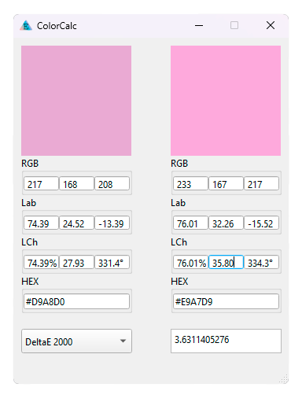

# ColorCalc

ColorCalc is a color comparison calculator
built with C++ and Qt 6. It allows users to
compare two colors using different DeltaE algorithms
and supports multiple input formats with auto-conversion

#### Supported DeltaE versions:

- DeltaE 2000
- DeltaE 94
- DeltaE CMC
- DeltaE 76

#### Supported Input colors types:

- RGB
- Lab
- LCh
- HEX

## Usage

1. Enter colors in any supported format.
2. Select the desired DeltaE algorithm.
3. View the computed DeltaE value to assess color difference.

